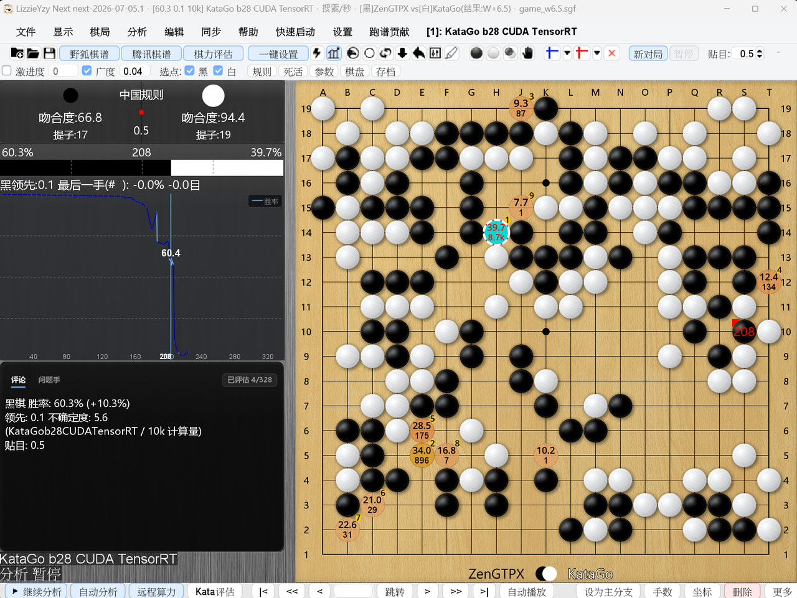
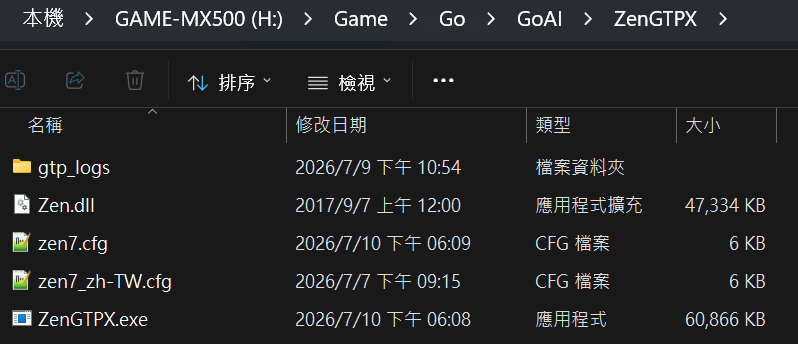
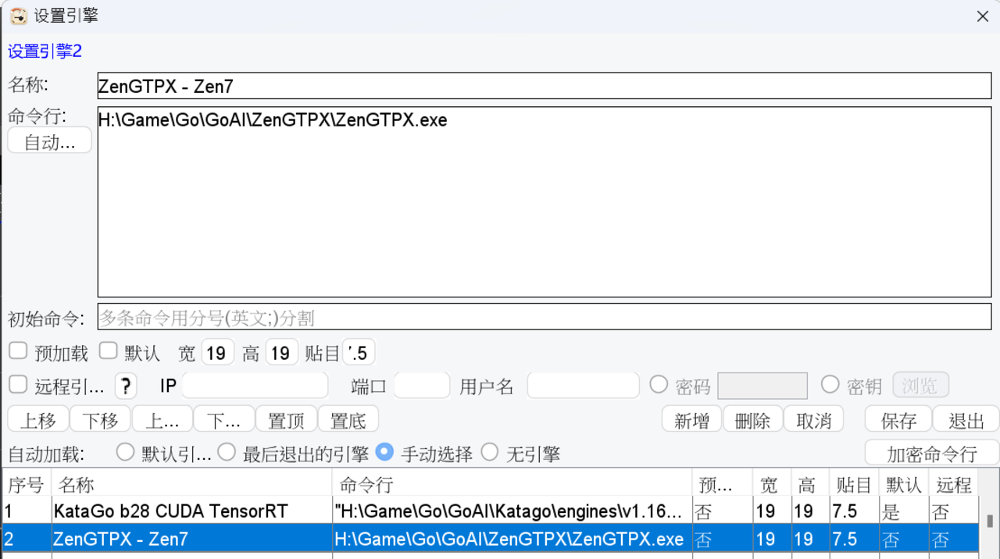
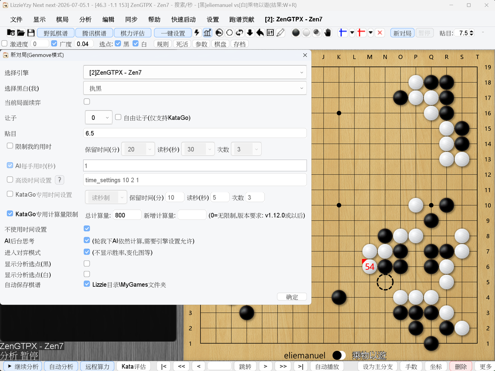
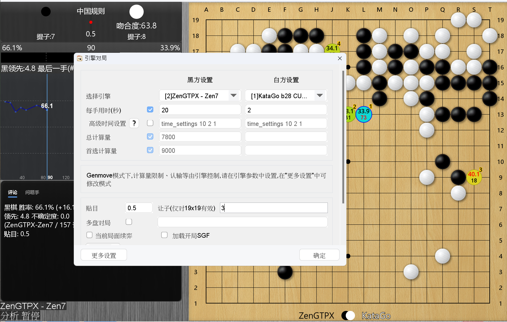
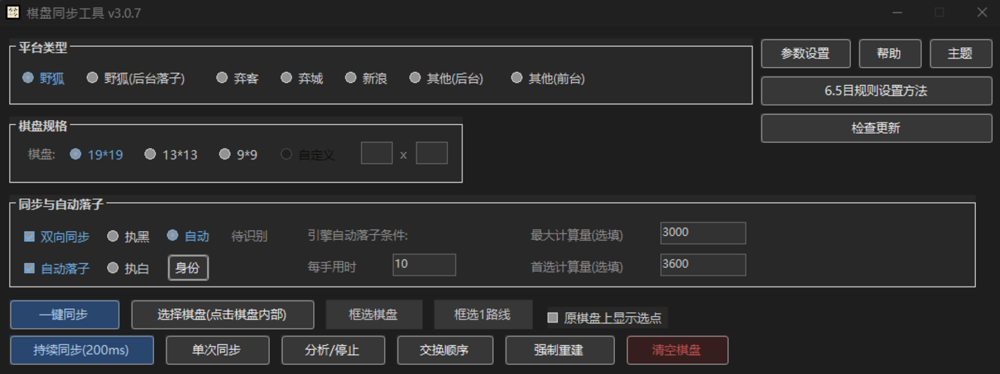
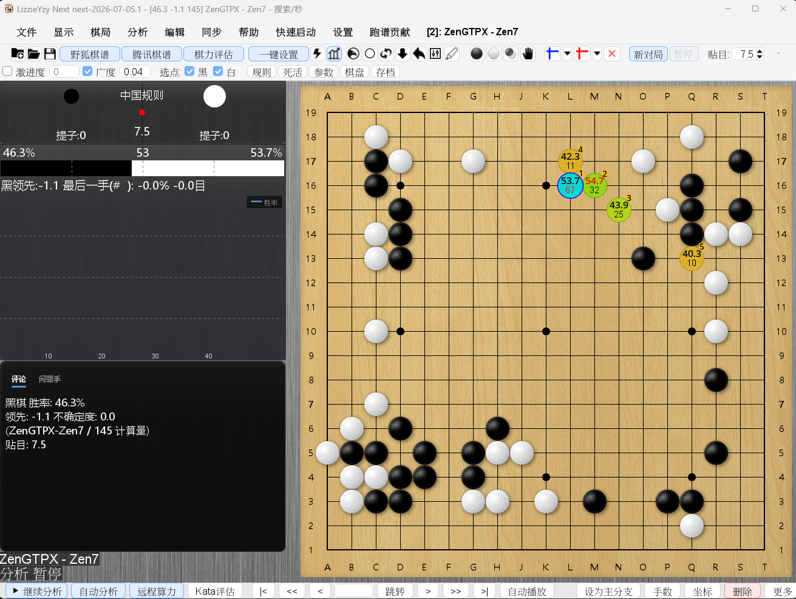

# ZenGTPX

ZenGTPX 是 Zen7 `Zen.dll` 的 Windows x86 GTP Wrapper，主要用途是在 LizzieYzy Next 中把 Zen7 當作一般 GTP Engine 使用。

適合想用 Zen7 下棋、做人機對局，或讓 Zen7 和其他圍棋 AI 引擎對局的使用者。

> ZenGTPX 不包含 Zen7 或 `Zen.dll`。請自行準備合法取得的 Zen7 `Zen.dll`。



## 下載與放置檔案

從 GitHub Release 下載 `ZenGTPX-v*-win-x86.zip` 並解壓縮。zip 內含簡短 `README.txt`、設定檔與 `ZenGTPX.exe`；解壓縮後請把 `Zen.dll` 放到 `ZenGTPX.exe` 同一個資料夾：

```text
ZenGTPX/
├─ ZenGTPX.exe
├─ Zen.dll
├─ zen7.cfg
└─ zen7_zh-TW.cfg
```

一般使用時，保留 `zen7.cfg` 即可。`zen7_zh-TW.cfg` 是繁體中文註解版設定檔，可作為參考或改名使用。



## 在 LizzieYzy Next 加入引擎

ZenGTPX 應該加入為「一般 GTP Engine」，不要設定成 KataGo Analysis JSON Engine。

新增引擎時，重點如下：

```text
Name: ZenGTPX
Engine path: ZenGTPX.exe 的完整路徑
Working directory: ZenGTPX.exe 所在資料夾
Arguments: 通常留空
```

如果想明確指定設定檔，也可以在 `Arguments` 填入：

```text
--config zen7.cfg
```



## 人機對局

基本設定方式：

```text
Black: Human 或 ZenGTPX
White: ZenGTPX 或 Human
Board size: 19
Komi: 依使用規則設定
Handicap: 視需要設定
```

開始對局後，LizzieYzy Next 會透過 GTP 指令將人類落子傳送給 ZenGTPX，並取得 Zen7 的回應落子。

若希望降低或提高 Zen7 棋力，可修改 `zen7.cfg`：

```cfg
mode = rank
rankPreset = 9d
```

可使用的段位範圍：

```text
6k, 5k, 4k, 3k, 2k, 1k,
1d, 2d, 3d, 4d, 5d, 6d, 7d, 8d, 9d
```



## 引擎對局

ZenGTPX 也可以在 LizzieYzy Next 中與另一個 GTP 引擎進行自動對局，例如：

```text
Black: ZenGTPX
White: KataGo
```

設定時需注意：

- ZenGTPX 應使用一般 GTP Engine 設定。
- 對手引擎應依該引擎本身的方式加入 LizzieYzy Next。
- 雙方的棋盤大小、貼目與讓子條件應保持一致。
- 若使用時間控制，建議先從較簡單且寬鬆的設定開始測試。
- ZenGTPX 已支援 LizzieYzy Next 引擎對局所需的 `lz-genmove_analyze`、`kata-genmove_analyze` 與 `genmove_analyze` 指令。



## 棋力與用時設定

一般使用者建議修改 `zen7.cfg` 內的這幾個值即可：

```cfg
mode = rank
rankPreset = 9d
```

可用棋力範例：

```text
6k, 5k, 4k, 3k, 2k, 1k,
1d, 2d, 3d, 4d, 5d, 6d, 7d, 8d, 9d
```

如果想固定每手思考時間，可改用：

```cfg
mode = fixed-time
maxTimeSeconds = 30
```

完整設定請看 [設定檔說明](docs/tw/configuration.md)。

## Configuration Protocol

ZenGTPX v0.96 新增可自動發現的 Configuration Protocol v1，供 LizzieYzy Next 或其他 GTP client 查詢配置 schema、套用棋力 profile，並取得實際生效值。

此功能是可選的，不影響既有普通 GTP 對局、分析及 ReadBoard 使用方式。目前尚未整合此協議的 GUI，仍可繼續使用 `zen7.cfg` 或啟動參數設定棋力。

完整接口與整合方式請看 [Configuration Protocol v1](docs/tw/configuration-protocol.md)。

## 網路棋盤同步

LizzieYzy Next 的 ReadBoard / 同步棋盤功能可搭配 ZenGTPX 使用，例如在野狐圍棋對局時，由 LizzieYzy Next 讀取棋盤，再由 ZenGTPX 負責產生落子。

這類功能主要在 LizzieYzy Next 內設定，ZenGTPX 仍只需要作為一般 GTP Engine 加入。





## 快速測試

也可以在 PowerShell 中直接啟動：

```powershell
.\ZenGTPX.exe
```

如果看到程式等待輸入，代表已進入 GTP 模式。實際使用時通常不需要手動操作，由 LizzieYzy Next 啟動即可。

## 常見問題

### 找不到 Zen.dll

請確認 `Zen.dll` 與 `ZenGTPX.exe` 在同一個資料夾，或確認 `zen7.cfg` 內的設定：

```cfg
zenDll = Zen.dll
```

### LizzieYzy Next 無法啟動 ZenGTPX

請檢查：

- `Engine path` 是否指向 `ZenGTPX.exe`
- `Working directory` 是否為 `ZenGTPX.exe` 所在資料夾
- `Zen.dll` 是否存在
- `Zen.dll` 是否為 x86 版本
- 是否誤設為 KataGo Analysis JSON Engine

更多內容可看 [疑難排解](docs/tw/troubleshooting.md)。

## 其他文件

- [功能說明](FEATURES.md)
- [LizzieYzy Next 設定](docs/tw/lizzieyzy-next.md)
- [設定檔說明](docs/tw/configuration.md)
- [Configuration Protocol v1](docs/tw/configuration-protocol.md)
- [GTP 相容命令](docs/tw/gtp-extensions.md)

## 注意事項

- ZenGTPX 只支援 Windows x86。
- ZenGTPX 不提供、不重新散布 Zen7 或 `Zen.dll`。
- ZenGTPX 不是 KataGo，亦不支援 KataGo `analysis` JSON protocol。
- 實際棋力與速度會受到 Zen7 設定與電腦硬體影響。
